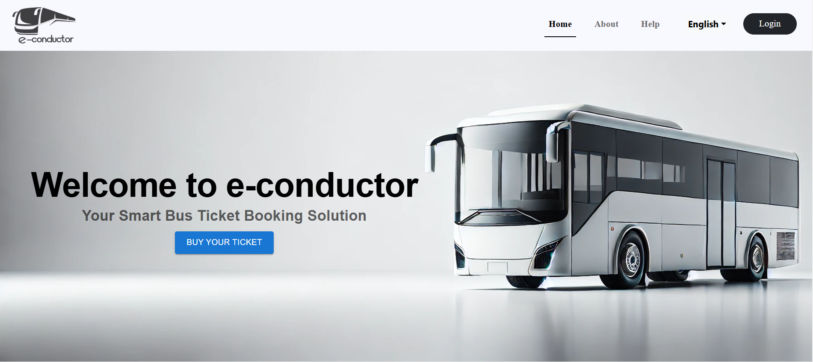

# **e-Conductor**

---

## **Team**

- **E/20/032**: Bandara A.M.N.C.  
- **E/20/035**: Bandara K.C.H.N.A.W.M.R.C.J.N.  
- **E/20/133**: Haththella H.A.D.T.N.  
- **E/20/157**: Janakantha S.M.B.G.  

---

## **Introduction**

**e-Conductor** is an innovative online bus ticketing platform designed for passengers, bus owners, and transport authorities. It features:  

- A **mobile app** for ticket booking, schedules, and real-time updates.  
- An **admin web portal** for bus tracking, schedule management, and revenue analysis.  

This system aims to streamline bus operations, enhance user convenience, and improve operational efficiency across the transport sector.  

---

---

## **Technology Stack**

This project allows flexibility in the choice of technologies. Potential options include:  

- **Front-end**: HTML, CSS, JavaScript, React  
- **Back-end**: Node.js  
- **Database**: MySQL  

---

## **Passenger Role**

### **Key Features & Tasks**

1. **Search for Buses**:  
   - Passengers can search for buses by providing the origin, destination, and travel date.  

2. **View Bus Details**:  
   - View information such as departure and arrival times, ticket prices, and seat availability.  

3. **Select Seats**:  
   - Passengers can choose seats interactively from a seat layout, reserving them upon payment.  

4. **Book Tickets**:  
   - Complete bookings by making payments through various supported methods.  

5. **View Booking History**:  
   - Access past and current bookings with details like ticket numbers, seat numbers, travel dates, and bus information.  

6. **Cancel Bookings**:  
   - Cancel bookings from the booking history as per the system’s refund policy.  

---

## **Conductor Role**

### **Key Features & Tasks**

1. **Add Bus Details**:  
   - Add new buses to the system, specifying routes, schedules, ticket prices, and seating configurations.  

2. **Manage Routes**:  
   - Update or add new routes to ensure the schedule remains accurate.  

3. **Monitor Bookings**:  
   - View real-time booking statistics and seat availability to optimize operations.  

4. **Update Bus Status**:  
   - Update live bus statuses, such as delays or cancellations, for real-time tracking.  

5. **Generate Sales Reports**:  
   - Analyze reports on ticket sales, revenue, and passenger data for specific time frames.  

---

## **Admin Role**

### **Key Features & Tasks**

1. **User Management**:  
   - Manage user profiles, reset passwords, and deactivate or block accounts as needed.  

2. **Manage Bookings**:  
   - Access and resolve booking issues, including cancellations and complaints.  

3. **Schedule Management**:  
   - Create, update, or delete bus schedules, managing routes and time slots.  

4. **Real-Time Bus Tracking**:  
   - Track buses live on a centralized dashboard, addressing delays or operational issues.  

5. **Revenue Tracking**:  
   - Generate revenue reports (daily, weekly, monthly) for financial analysis.  

6. **System Maintenance**:  
   - Configure system settings, manage refund policies, and ensure data integrity.  

7. **Notifications and Communication**:  
   - Send notifications about schedule changes, cancellations, or promotions.  

8. **Performance Analytics**:  
   - Use dashboards to analyze user activity and system performance, implementing improvements.  

---

## **Links**

- [Project Repository](https://github.com/cepdnaclk/e20-co227-e-Conductor)  
- [Project Page](https://cepdnaclk.github.io/e20-co227-e-Conductor/)  
- [Department of Computer Engineering](http://www.ce.pdn.ac.lk/)  
- [University of Peradeniya](https://eng.pdn.ac.lk/)  

